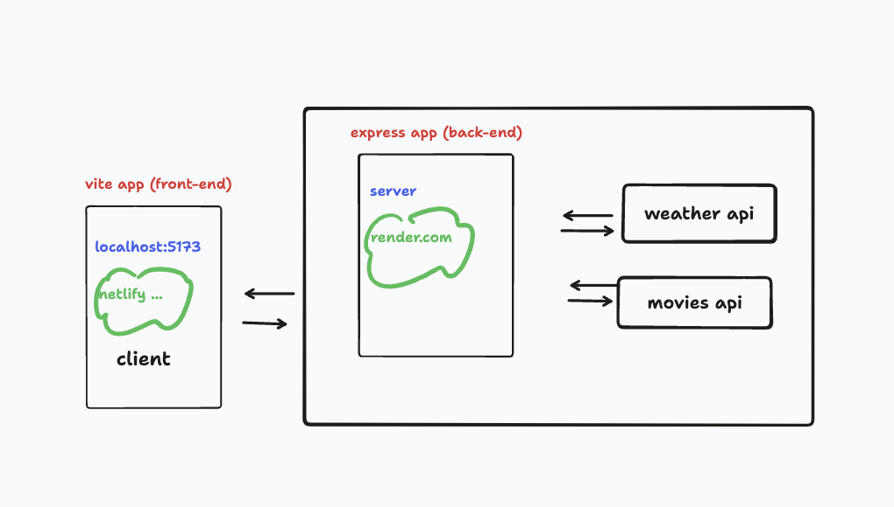
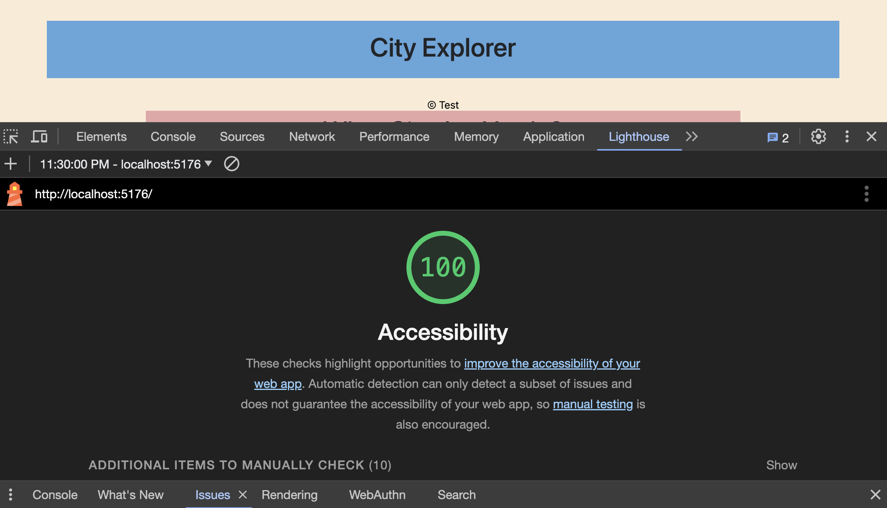

# City Explorer Lab 06-10

## Lab 07 - Custom Servers with Node and Express

**Author**: Xin Deng
**Version**: 1.0.1 (increment the patch/fix version number if you make more commits past your first submission)

## Overview
<!-- Provide a high level overview of what this application is and why you are building it, beyond the fact that it's an assignment for this class. (i.e. What's your problem domain?) -->

Build our own custom Express server in Node.js. We will server our front end static files.

## Getting Started
<!-- What are the steps that a user must take in order to build this app on their own machine and get it running? -->

Hook up a front end React application with a back end server
Create an Express server from scratch

## Architecture
<!-- Provide a detailed description of the application design. What technologies (languages, libraries, etc) you're using, and any other relevant design information. -->
REACT, JavaScript, APIs, Axios and are used.

## Change Log
<!-- Use this area to document the iterative changes made to your application as each feature is successfully implemented. Use time stamps. Here's an example:

01-01-2001 4:59pm - Application now has a fully-functional express server, with a GET route for the location resource. -->

- 12-05-2023 2:30pm - Application now has structures and files needed to start
- 12-05-2023 11:32pm - Application now has backend getting right data

## Credit and Collaborations
<!-- Give credit (and a link) to other people or resources that helped you build this application. -->

[Johns In Class Demo](https://github.com/codefellows/seattle-code-301d110/tree/main/class-07/demo)

ChatGPT/Tammy, John, Brandon

<!-- Monday: Chris Acosta
 -->

Tuesday: Brendan/Steph

Wednesday: Self

## Time Estimates 

1. Number and name of feature: Feature #1: Set up server repo
    - Estimate of time needed to complete: 2 hrs
    - Start time: 1:40pm
    - Finish time: 2:30pm
    - Actual time needed to complete: 1 hr

1. Number and name of feature: Feature #2: Weather (placeholder): As a user of City Explorer, I want to see weather info for the city I searched, so that I know how to pack for an upcoming trip.longitude of that location.
    - Estimate of time needed to complete: 3 hrs
    - Start time: 2:30pm
    - Finish time: 11:32pm
    - Actual time needed to complete: 8 hrs and still not done

1. Number and name of feature: Feature 3: Errors (revisited): As a user, I want clear messages if something goes wrong so I know if I need to make any changes or try again in a different manner.
    - Estimate of time needed to complete: 3 hrs
    - Start time: NA
    - Finish time: NA
    - Actual time needed to complete: NA

## Lighthouse Accessibility Report Score

### Reflections and Comments

1. A link to the deployed version of your latest code.
1. A link to your public Trello board.
1. A question within the context of this lab assignment.
    - I still not sure how to debug backend and front end at the same time. Localhost, api is still so confusing
1. An observation about the lab assignment, or related ‘Ah-hah!’ moment.
    - When Tammy help me figure out what to get from the nested data.

1. How long you spent working on this assignment.
  - Almost 10 hrs and still not done.

## Time Estimates Lab 8

1. Number and name of feature: Feature #1: Weather (live): As a user of City Explorer, I want to see weather info for the city I searched, so that I know how to pack for an upcoming trip.
    - Estimate of time needed to complete: 3 hrs
    - Start time: 2:30pm
    - Finish time: 7:00pm
    - Actual time needed to complete: 5 hr 30 min

1. Number and name of feature: Feature #2: Movies: As a user of City Explorer, I want to see info about movies related to the city I searched, so that I can learn more about the destination. how to pack for an upcoming trip.longitude of that location.
    - Estimate of time needed to complete: 3 hrs
    - Start time: 7:00pm
    - Finish time: NA
    - Actual time needed to complete: 9 hrs and still not done

1. Number and name of feature: Feature #3:Publish: Deploy your server. As a user, I want to access the City Explorer application on the web, so that anyone can explore from anywhere.
    - Estimate of time needed to complete: 3 hrs
    - Start time: NA
    - Finish time: NA
    - Actual time needed to complete: NA

## Lighthouse Accessibility Report Score

### Reflections and Comments

1. A link to the deployed version of your latest code.
1. A link to your public Trello board.
1. A question within the context of this lab assignment.
    - I don't understand how to get localhost working to debug. I'm collecting server errors like pokemon cards like what "hundreds" number am I going to get next...
1. An observation about the lab assignment, or related ‘Ah-hah!’ moment.
    - I had an ah-hah moment when Brandon showed me how to get local host to work but then I forgot... I thought it was a plug and chug lab since we already written the weather function yesterday, but wow it's so complicated. 
1. How long you spent working on this assignment.
    - 9 hours and I'm still not done. I stayed up till 6:30am to finish lab07 and I have a feeling I will tonight as well. 

