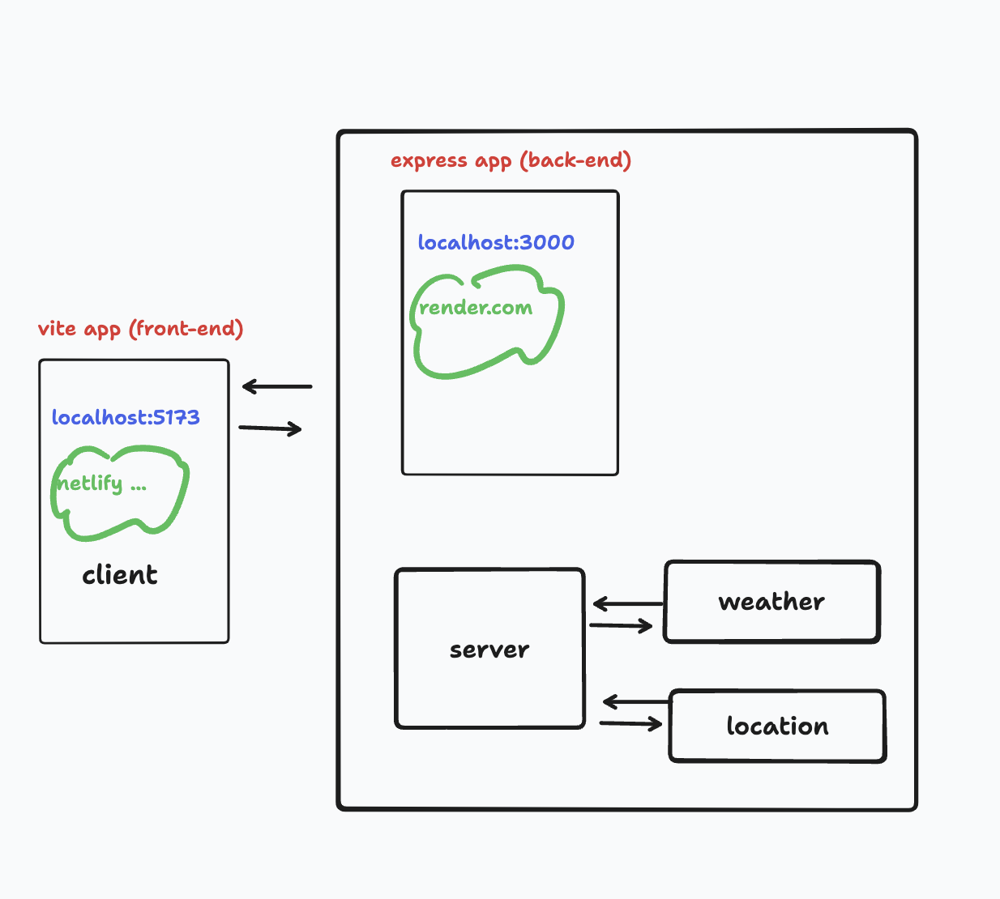

# City Explorer Lab 06-10

## Lab 07 - Custom Servers with Node and Express

**Author**: Xin Deng
**Version**: 1.0.0 (increment the patch/fix version number if you make more commits past your first submission)

## Overview
<!-- Provide a high level overview of what this application is and why you are building it, beyond the fact that it's an assignment for this class. (i.e. What's your problem domain?) -->

Building a City Finder that displays a map of the city the user types in.
## Getting Started
<!-- What are the steps that a user must take in order to build this app on their own machine and get it running? -->

- Create different components of the app
- Connect to API
- Create functions in to get and display API data

## Architecture
<!-- Provide a detailed description of the application design. What technologies (languages, libraries, etc) you're using, and any other relevant design information. -->
REACT, JavaScript, Bootstrap, CSS, APIs, Axios and are used.

## Change Log
<!-- Use this area to document the iterative changes made to your application as each feature is successfully implemented. Use time stamps. Here's an example:

01-01-2001 4:59pm - Application now has a fully-functional express server, with a GET route for the location resource. -->

- 12-04-2023 3:00pm - Application now has structures and files needed to start
- 12-04-2023 5:20pm - Application now has a form that can enter a city and get back lat and lon
- 12-04-2023 6:50pm - Application now has a rendered map of that city
- 12-04-2023 7:20pm - Application now has an alert if something goes wrong 

## Credit and Collaborations
<!-- Give credit (and a link) to other people or resources that helped you build this application. -->

[Johns In Class Demo](https://github.com/codefellows/seattle-code-301d110/tree/main/class-07/demo)

Monday: Chris Acosta

Tuesday: David Sharma

## Time Estimates

1. Number and name of feature: Feature #1: Set up server repo
    - Estimate of time needed to complete: 2 hrs
    - Start time: 1:40pm
    - Finish time: 2:30pm
    - Actual time needed to complete: 1 hr

1. Number and name of feature: Feature #2: Weather (placeholder): As a user of City Explorer, I want to see weather info for the city I searched, so that I know how to pack for an upcoming trip.longitude of that location.
    - Estimate of time needed to complete: 3 hrs
    - Start time: 2:39pm
    - Finish time: 5:20pm
    - Actual time needed to complete: 2 hr 20 min

1. Number and name of feature: Feature 3: Errors (revisited): As a user, I want clear messages if something goes wrong so I know if I need to make any changes or try again in a different manner.
    - Estimate of time needed to complete: 3 hrs
    - Start time: 5:20pm
    - Finish time: 6:50pm
    - Actual time needed to complete: 2 hrs

## Lighthouse Accessibility Report Score

### Reflections and Comments

1. A link to the deployed version of your latest code.
1. A link to your public Trello board.
1. A question within the context of this lab assignment.
- My map rendered in the preview and in the live server and now it isn't working I don't get it. I'm really frustrated. I'm taking a loss on this lab. I'm tired....
1. An observation about the lab assignment, or related ‘Ah-hah!’ moment.
- There has to be a better way to debug, why am I being shown that things are working when they dont. CSS is still so confusing. 

1. How long you spent working on this assignment.
  - Almost six hours 