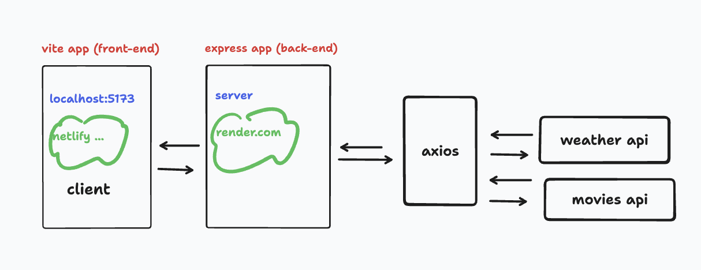
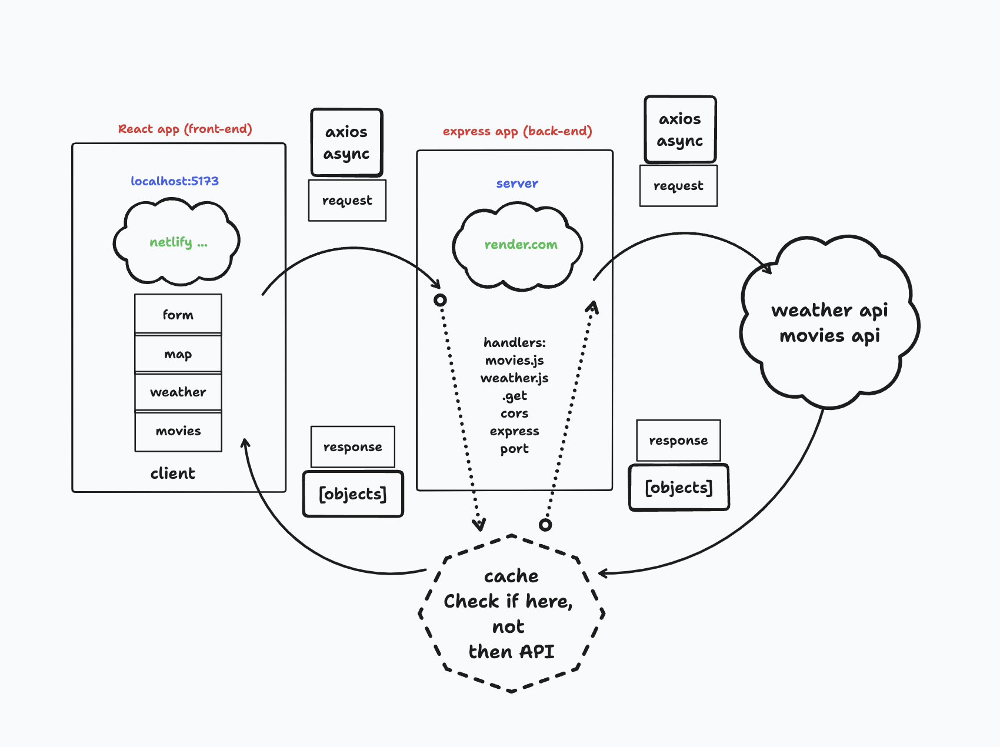
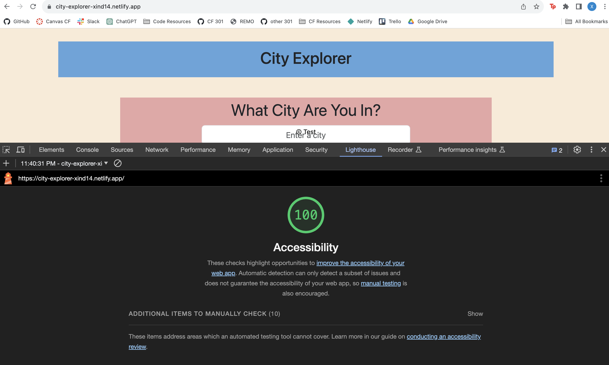

# City Explorer Lab 07-10

## Labs

**Author**: Xin Deng

### Lab 07 - Custom Servers with Node and Express

**Version**: 1.0.0 (increment the patch/fix version number if you make more commits past your first submission)

### Lab 08

**Version**: 1.0.1 (increment the patch/fix version number if you make more commits past your first submission)

### Lab 09

**Version**: 1.0.2 (increment the patch/fix version number if you make more commits past your first submission)

### Lab 10

**Version**: 1.0.3 (increment the patch/fix version number if you make more commits past your first submission)

## Overview
<!-- Provide a high level overview of what this application is and why you are building it, beyond the fact that it's an assignment for this class. (i.e. What's your problem domain?) -->

Build our own custom Express server in Node.js. We will server our front end static files.

## Getting Started
<!-- What are the steps that a user must take in order to build this app on their own machine and get it running? -->

Hook up a front end React application with a back end server. Create an Express server from scratch

## Architecture
<!-- Provide a detailed description of the application design. What technologies (languages, libraries, etc) you're using, and any other relevant design information. -->
REACT, JavaScript, APIs, Axios and are used.

## Change Log
<!-- Use this area to document the iterative changes made to your application as each feature is successfully implemented. Use time stamps. Here's an example:

01-01-2001 4:59pm - Application now has a fully-functional express server, with a GET route for the location resource. -->

### Lab 07

- 12-05-2023 11:32pm - Application now has backend getting right data
- 12-06-2023 06:30am - Application now has forecast rendered from API

### Lab 08

- 12-07-2023 11:32pm - Application now has live forecast and movies rendered from API

### Lab 09

- 12-08-2023 04:30am - Application now has server side refactored

### Lab 10

- 12-09-2023 04:30pm - Application now has live forecast and movies rendered from API inside cache.

## Credit and Collaborations
<!-- Give credit (and a link) to other people or resources that helped you build this application. -->

[Johns In Class Demo Lab 07](https://github.com/codefellows/seattle-code-301d110/tree/main/class-07/demo)

[Johns In Class Demo Lab 08](https://github.com/codefellows/seattle-code-301d110/tree/main/class-08/demo)

[Johns In Class Demo Lab 10](https://github.com/codefellows/seattle-code-301d110/tree/main/class-10/demo)

[React Emojis for Forecast](https://dreamyguy.github.io/react-emojis/)

ChatGPT/Tammy, John, Brandon

Tuesday: Brendan, Steph

Wednesday: Self

Thursday: Self

Friday: Self

## Time Estimates 

### Lab 07

1. Number and name of feature: Feature #1: Set up server repo
    - Estimate of time needed to complete: 2 hrs
    - Start time: 1:40pm
    - Finish time: 2:30pm
    - Actual time needed to complete: 1 hr

1. Number and name of feature: Feature #2: Weather (placeholder): As a user of City Explorer, I want to see weather info for the city I searched, so that I know how to pack for an upcoming trip.longitude of that location.
    - Estimate of time needed to complete: 3 hrs
    - Start time: 2:30pm
    - Finish time: 11:32pm
    - Actual time needed to complete: 8 hrs and still not done

1. Number and name of feature: Feature 3: Errors (revisited): As a user, I want clear messages if something goes wrong so I know if I need to make any changes or try again in a different manner.
    - Estimate of time needed to complete: 3 hrs
    - Start time: NA
    - Finish time: NA
    - Actual time needed to complete: NA

### Lab 08

1. Number and name of feature: Feature #1: Weather (live): As a user of City Explorer, I want to see weather info for the city I searched, so that I know how to pack for an upcoming trip.
    - Estimate of time needed to complete: 3 hrs
    - Start time: 2:30pm
    - Finish time: 7:00pm
    - Actual time needed to complete: 5 hr 30 min

1. Number and name of feature: Feature #2: Movies: As a user of City Explorer, I want to see info about movies related to the city I searched, so that I can learn more about the destination. how to pack for an upcoming trip.longitude of that location.
    - Estimate of time needed to complete: 3 hrs
    - Start time: 7:00pm
    - Finish time: NA
    - Actual time needed to complete: 9 hrs and still not done

1. Number and name of feature: Feature #3:Publish: Deploy your server. As a user, I want to access the City Explorer application on the web, so that anyone can explore from anywhere.
    - Estimate of time needed to complete: 3 hrs
    - Start time: NA
    - Finish time: NA
    - Actual time needed to complete: NA

### Lab 09

1. Number and name of feature: Feature #1: Refactor: Modularize the back-end codebase.
    - Estimate of time needed to complete: 3 hrs
    - Start time: 4:30pm
    - Finish time: 8:00pm
    - Actual time needed to complete: 4 hr 30 min

1. Number and name of feature: Feature #2: Refactor: Componentize the front-end codebase.
    - Estimate of time needed to complete: 3 hrs
    - Start time: 10:00pm
    - Finish time: NA
    - Actual time needed to complete: 8 hrs and still not done

### Lab 10

1. Number and name of feature: Feature #1: Performance: As a user, I want the application to work with recent results, so that I can see info without the app doing unnecessary API calls.
    - Estimate of time needed to complete: 3 hrs
    - Start time: 3:00pm
    - Finish time: 7:00pm
    - Actual time needed to complete: 4 hrs

## Lighthouse Accessibility Report Score

  <!-- 
  local host issue fixes
  lsof -i :3000 = error address already in use
  kill -9 <PID>
  npx kill-port 3000 -->
